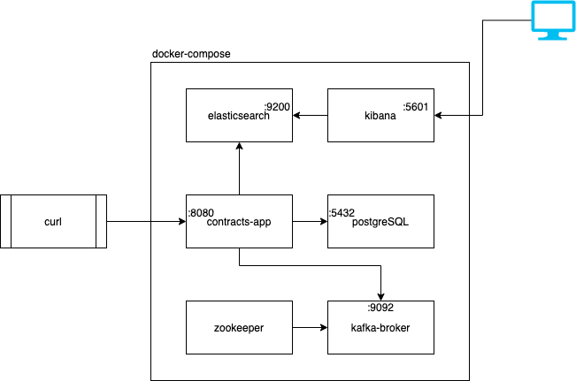

# Getting Started

### Reference Documentation
For further reference, please consider the following sections:

* [Official Apache Maven documentation](https://maven.apache.org/guides/index.html)
* [Spring Boot Maven Plugin Reference Guide](https://docs.spring.io/spring-boot/docs/2.5.6/maven-plugin/reference/html/)
* [Create an OCI image](https://docs.spring.io/spring-boot/docs/2.5.6/maven-plugin/reference/html/#build-image)
* [Spring Data JPA](https://docs.spring.io/spring-boot/docs/2.5.6/reference/htmlsingle/#boot-features-jpa-and-spring-data)
* [Validation](https://docs.spring.io/spring-boot/docs/2.5.6/reference/htmlsingle/#boot-features-validation)
* [Spring Data Elasticsearch (Access+Driver)](https://docs.spring.io/spring-boot/docs/2.5.6/reference/htmlsingle/#boot-features-elasticsearch)
* [Rest Repositories](https://docs.spring.io/spring-boot/docs/2.5.6/reference/htmlsingle/#howto-use-exposing-spring-data-repositories-rest-endpoint)
* [Security](https://docs.spring.io/spring-boot/docs/2.5.6/reference/htmlsingle/#features.security)

### Guides
The following guides illustrate how to use some features concretely:

* [Accessing Data with JPA](https://spring.io/guides/gs/accessing-data-jpa/)
* [Accessing JPA Data with REST](https://spring.io/guides/gs/accessing-data-rest/)

### Build and run it with
```console
mvn clean package pre-integration-test -DskipTests
```
### containerized Infrastructure

